# Capítulo 01: Bases de Datos y Usuarios de Bases de Datos

---

## ¿Qué es una Base de Datos?

Una **Base de Datos (BD)** es un sistema organizado para almacenar, gestionar y recuperar grandes volúmenes de información de manera eficiente y segura. Su objetivo principal es facilitar el acceso, la manipulación y la protección de los datos, permitiendo que múltiples usuarios trabajen simultáneamente sin perder integridad ni seguridad.

### Explicación Detallada

Las bases de datos surgieron como respuesta a la necesidad de manejar información compleja en empresas, gobiernos y organizaciones. Antes de su existencia, los datos se almacenaban en archivos físicos o digitales sin estructura, lo que dificultaba la búsqueda, el análisis y la actualización. Una base de datos utiliza estructuras como tablas, registros y campos para organizar la información, permitiendo relaciones entre diferentes conjuntos de datos.

Por ejemplo, en una universidad, una base de datos puede almacenar información de estudiantes, profesores, materias y calificaciones, relacionando cada entidad para facilitar consultas como: "¿Qué materias cursó un estudiante en el último año?" o "¿Cuáles son los profesores que dictan una materia específica?".

### Ejemplo Desarrollado

Supongamos una empresa de ventas:
- **Clientes:** Nombre, dirección, teléfono, historial de compras.
- **Productos:** Código, descripción, precio, stock.
- **Pedidos:** Fecha, cliente, productos solicitados, estado del pedido.

La base de datos permite saber qué clientes compraron un producto específico, cuáles son los productos más vendidos, y gestionar el inventario en tiempo real.

### Gráfico Conceptual

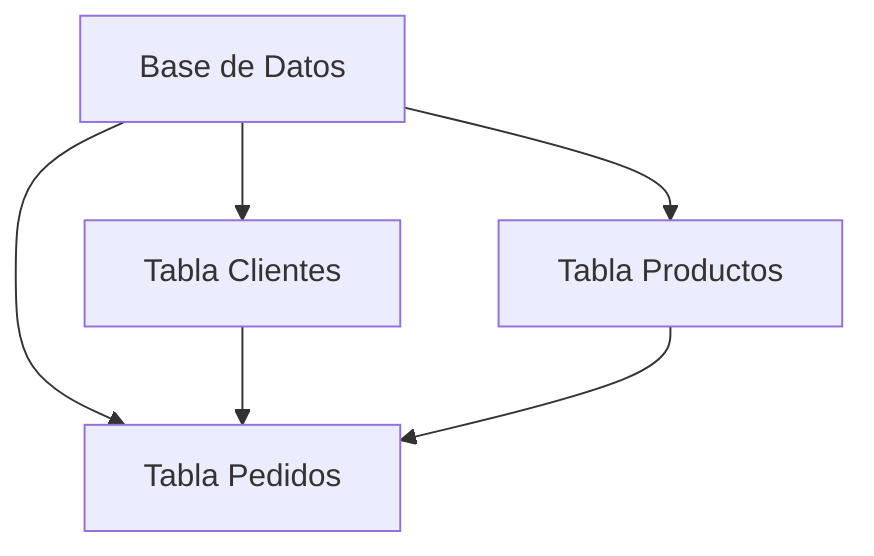

---

## Evolución de los Sistemas de Información

La gestión de datos ha evolucionado significativamente desde los primeros registros escritos hasta los sistemas digitales actuales. Comprender esta evolución es clave para valorar el papel de las bases de datos modernas.

### 1. Archivos Tradicionales

En los inicios de la informática, la información se almacenaba en archivos planos, como hojas de cálculo, documentos de texto o registros físicos. Cada área de una organización podía tener sus propios archivos, lo que generaba problemas como:
- **Redundancia:** El mismo dato podía estar repetido en varios archivos.
- **Inconsistencia:** Si se actualizaba un dato en un archivo, podía quedar desactualizado en otros.
- **Dificultad de acceso:** Buscar información específica requería revisar manualmente muchos archivos.
- **Falta de seguridad:** Los archivos eran vulnerables a pérdidas, robos o modificaciones no autorizadas.

**Ejemplo:**
Una empresa llevaba la nómina de empleados en una hoja de cálculo y los datos de ventas en otra. Si un empleado cambiaba de dirección, había que actualizarlo en varios archivos, lo que podía generar errores.

### 2. Sistemas de Gestión de Archivos

Para mejorar la organización, surgieron los sistemas de gestión de archivos, que permitían almacenar datos de forma más estructurada, pero aún sin relaciones entre ellos. Estos sistemas facilitaban la búsqueda y el almacenamiento, pero seguían presentando problemas de redundancia y dificultad para relacionar información.

### 3. Bases de Datos Modernas

Con el avance de la tecnología, nacieron los Sistemas de Gestión de Bases de Datos (SGBD), que permiten:
- Integrar datos de diferentes áreas en un solo sistema.
- Relacionar información entre diferentes tablas y entidades.
- Mejorar la seguridad, integridad y acceso a la información.
- Permitir el acceso concurrente de múltiples usuarios.

**Ejemplo:**
En una universidad, un SGBD permite relacionar estudiantes, materias, profesores y calificaciones, facilitando consultas complejas y reportes automáticos.

### Gráfico Evolutivo

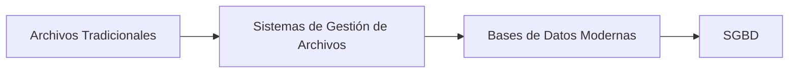

---

## Características de una Base de Datos

Las bases de datos modernas presentan una serie de características que las distinguen de los sistemas de archivos tradicionales y que son fundamentales para su funcionamiento eficiente y seguro:

### 1. Centralización de la Información
La información se almacena en un único repositorio, lo que facilita la administración, el acceso y la protección de los datos. Por ejemplo, en una empresa, todos los datos de clientes, ventas y productos están centralizados en una sola base de datos, evitando la dispersión y el desorden.

### 2. Reducción de Redundancia
Al estar los datos organizados y relacionados, se evita la duplicidad. Si un cliente realiza varias compras, su información personal se almacena una sola vez y se relaciona con sus pedidos, evitando inconsistencias.

### 3. Integridad de los Datos
Las bases de datos implementan reglas y restricciones (como claves primarias y foráneas) que aseguran que los datos sean precisos y consistentes. Por ejemplo, no se puede registrar un pedido para un cliente que no existe en la base de datos.

### 4. Seguridad
El acceso a los datos está controlado mediante permisos y roles. Solo los usuarios autorizados pueden consultar, modificar o eliminar información. Además, se pueden implementar auditorías y registros de actividad para detectar accesos no autorizados.

### 5. Acceso Concurrente
Varios usuarios pueden acceder y modificar los datos al mismo tiempo sin que se produzcan conflictos o pérdidas de información. Los SGBD gestionan bloqueos y transacciones para garantizar la integridad.

### 6. Independencia de Datos
La estructura física de los datos está separada de la lógica de acceso. Esto permite modificar la forma en que se almacenan los datos sin afectar a las aplicaciones que los utilizan.

### 7. Recuperación ante Fallos
Las bases de datos cuentan con mecanismos de respaldo y recuperación que permiten restaurar la información en caso de errores, fallos de hardware o ataques.

### Ejemplo Práctico
En un hospital, la base de datos centraliza la información de pacientes, médicos, tratamientos y turnos. Si un paciente cambia de dirección, el dato se actualiza una sola vez y se refleja en todos los registros relacionados, evitando errores y redundancias.

### Gráfico de Características

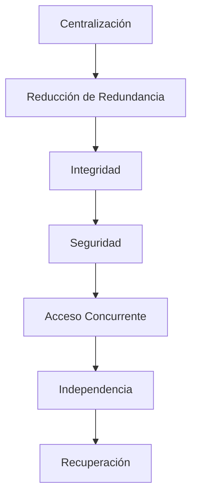

---

## Componentes de un Sistema de Bases de Datos

Un sistema de bases de datos está compuesto por varios elementos que trabajan en conjunto para garantizar el almacenamiento, acceso y gestión eficiente de la información:

### 1. Datos
Son el recurso principal. Incluyen toda la información relevante para la organización: registros de clientes, productos, transacciones, etc. Los datos pueden ser numéricos, alfanuméricos, fechas, imágenes, documentos, etc.

### 2. Hardware
Incluye los servidores, computadoras, dispositivos de almacenamiento y redes que soportan el funcionamiento de la base de datos. Un SGBD puede estar alojado en un servidor local, en la nube o en una infraestructura híbrida.

### 3. Software
El software principal es el Sistema de Gestión de Bases de Datos (SGBD), como MySQL, Oracle, SQL Server, PostgreSQL, MongoDB, entre otros. Además, incluye sistemas operativos, aplicaciones de respaldo, herramientas de monitoreo y seguridad.

### 4. Usuarios
Existen diferentes tipos de usuarios:
- **Administradores:** Gestionan la estructura, seguridad y rendimiento.
- **Desarrolladores:** Crean aplicaciones que interactúan con la base de datos.
- **Usuarios finales:** Consultan y manipulan datos a través de aplicaciones.
- **Auditores:** Revisan la integridad y seguridad de los datos.

### 5. Procedimientos
Son las políticas, normas y reglas que definen cómo se debe utilizar y proteger la base de datos. Incluyen procedimientos de respaldo, recuperación, mantenimiento, actualización y auditoría.

### Ejemplo de Componentes
En un banco, los datos incluyen cuentas, clientes y transacciones; el hardware son los servidores y terminales; el software es el SGBD y las aplicaciones bancarias; los usuarios son empleados, clientes y auditores; los procedimientos incluyen políticas de seguridad y respaldo diario.

### Gráfico de Componentes

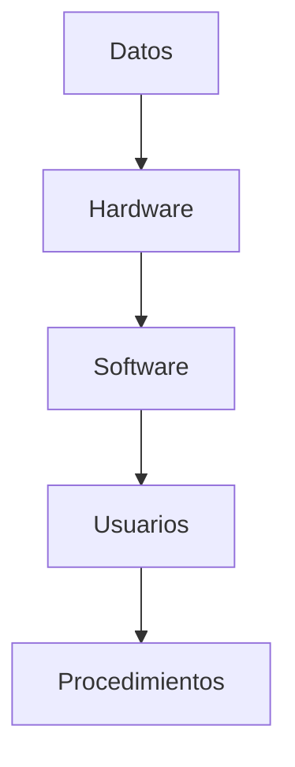

---

## Tipos de Usuarios de Bases de Datos

El uso de una base de datos implica la participación de diferentes tipos de usuarios, cada uno con responsabilidades y niveles de acceso distintos:

### 1. Usuarios Finales
Son quienes utilizan aplicaciones para consultar, ingresar o modificar datos. No interactúan directamente con el SGBD, sino a través de interfaces amigables. Ejemplo: Un cajero bancario que registra una transacción.

### 2. Programadores de Aplicaciones
Desarrollan el software que permite a los usuarios finales interactuar con la base de datos. Utilizan lenguajes de programación y herramientas de desarrollo para crear sistemas de gestión, reportes, formularios, etc.

### 3. Administradores de Bases de Datos (DBA)
Son responsables de la gestión integral de la base de datos: diseño, seguridad, rendimiento, respaldo y recuperación. El DBA define políticas de acceso, realiza mantenimiento y optimiza el sistema.

### 4. Diseñadores de Bases de Datos
Definen la estructura lógica y física de la base de datos, estableciendo las relaciones entre tablas, los tipos de datos y las restricciones de integridad. Su trabajo es clave para garantizar la eficiencia y escalabilidad del sistema.

### 5. Auditores y Analistas
Revisan la integridad, seguridad y cumplimiento de normativas. Analizan el uso de los datos y generan reportes para la toma de decisiones.

### Ejemplo de Roles
En un hospital:
- El médico (usuario final) consulta el historial de un paciente.
- El programador desarrolla el sistema de turnos.
- El DBA gestiona la seguridad y el respaldo de la información.
- El diseñador define cómo se relacionan pacientes, médicos y tratamientos.
- El auditor verifica el cumplimiento de la ley de protección de datos.

### Gráfico de Roles

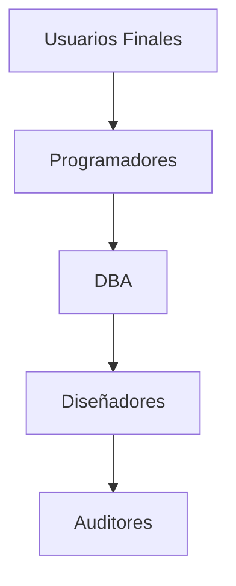

---

## El Administrador de la Base de Datos (DBA)

El DBA es el responsable técnico y estratégico de la base de datos. Su rol es fundamental para garantizar la seguridad, disponibilidad y rendimiento del sistema.

### Funciones Principales
- **Diseño y planificación:** Define la estructura lógica y física de la base de datos, elige el SGBD adecuado y planifica la escalabilidad.
- **Seguridad:** Establece políticas de acceso, encripta datos sensibles, audita el uso y responde ante incidentes.
- **Respaldo y recuperación:** Programa y verifica copias de seguridad, diseña planes de recuperación ante desastres y realiza pruebas periódicas.
- **Optimización:** Monitorea el rendimiento, ajusta índices, consulta y recursos para evitar cuellos de botella.
- **Actualización y mantenimiento:** Aplica parches, actualiza versiones y realiza tareas de mantenimiento preventivo.
- **Soporte y capacitación:** Asiste a usuarios y desarrolladores, capacita en buenas prácticas y resuelve incidencias.

### Ejemplo Real
En una empresa de comercio electrónico, el DBA:
- Protege los datos de clientes y transacciones.
- Realiza respaldos diarios y pruebas de recuperación.
- Optimiza consultas para que el sitio web funcione rápido.
- Audita accesos para detectar fraudes.
- Actualiza el sistema para evitar vulnerabilidades.

### Gráfico de Funciones del DBA

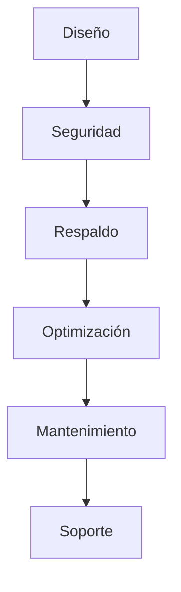

---

## Lenguajes de Bases de Datos

Para interactuar con una base de datos, existen diferentes lenguajes especializados que permiten definir, manipular y controlar los datos y su acceso:

### 1. Lenguaje de Definición de Datos (DDL)
Permite crear, modificar y eliminar estructuras de datos como tablas, índices y vistas. Ejemplo de comandos DDL:
```sql
CREATE TABLE empleados (
    id INT PRIMARY KEY,
    nombre VARCHAR(100),
    puesto VARCHAR(50)
);
ALTER TABLE empleados ADD COLUMN fecha_ingreso DATE;
DROP TABLE empleados;
```

### 2. Lenguaje de Manipulación de Datos (DML)
Permite consultar, insertar, modificar y eliminar datos dentro de las estructuras creadas. Ejemplo de comandos DML:
```sql
INSERT INTO empleados VALUES (1, 'Juan Pérez', 'Analista', '2022-01-10');
UPDATE empleados SET puesto = 'Jefe' WHERE id = 1;
DELETE FROM empleados WHERE id = 1;
SELECT * FROM empleados;
```

### 3. Lenguaje de Control de Datos (DCL)
Permite gestionar los permisos y el acceso a los datos. Ejemplo de comandos DCL:
```sql
GRANT SELECT ON empleados TO usuario1;
REVOKE SELECT ON empleados FROM usuario1;
```

### 4. Lenguaje de Control de Transacciones (TCL)
Permite gestionar transacciones, asegurando que las operaciones se realicen de forma completa y segura. Ejemplo de comandos TCL:
```sql
BEGIN;
UPDATE empleados SET puesto = 'Jefe' WHERE id = 1;
COMMIT;
ROLLBACK;
```

### Ejemplo Integrado
En una empresa, el DBA utiliza DDL para crear la estructura de la base de datos, DML para cargar y modificar datos, DCL para asignar permisos a los empleados y TCL para asegurar la integridad de las operaciones.

### Gráfico de Lenguajes

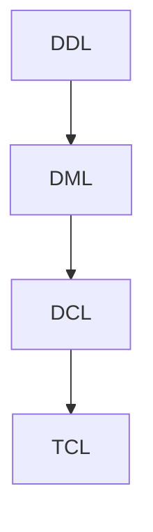

---

## Modelos de Bases de Datos

A lo largo de la historia, se han desarrollado diferentes modelos para organizar y relacionar los datos en una base de datos. Los principales son:

### 1. Modelo Jerárquico
Organiza los datos en una estructura de árbol, donde cada registro tiene un único padre y puede tener varios hijos. Es útil para representar relaciones uno a muchos, como la organización de archivos en carpetas.
- **Ejemplo:** Un sistema de gestión de empleados donde cada departamento tiene varios empleados, pero cada empleado pertenece a un solo departamento.

### 2. Modelo de Red
Permite relaciones más complejas, donde un registro puede tener múltiples padres y múltiples hijos. Es útil para representar relaciones muchos a muchos.
- **Ejemplo:** Un sistema académico donde los estudiantes pueden inscribirse en varias materias y cada materia puede tener varios estudiantes.

### 3. Modelo Relacional
Organiza los datos en tablas relacionadas entre sí mediante claves primarias y foráneas. Es el modelo más utilizado actualmente por su flexibilidad y potencia.
- **Ejemplo:** Un sistema de ventas con tablas de clientes, productos y pedidos, donde los pedidos relacionan clientes y productos.

### 4. Modelo Orientado a Objetos
Representa los datos como objetos, integrando conceptos de la programación orientada a objetos. Es útil para aplicaciones complejas y multimedia.
- **Ejemplo:** Un sistema de diseño gráfico donde cada imagen, forma y color es un objeto con propiedades y métodos.

### 5. Modelos NoSQL
Incluyen bases de datos de documentos, clave-valor, columnares y grafos. Son ideales para grandes volúmenes de datos no estructurados y aplicaciones web escalables.
- **Ejemplo:** Una red social que almacena publicaciones, comentarios y relaciones entre usuarios en una base de datos de grafos.

### Gráfico Comparativo

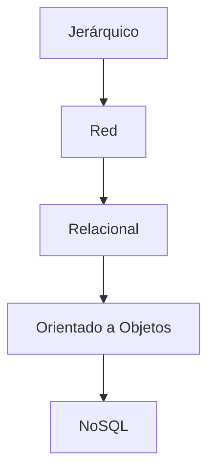

---

## Ventajas de las Bases de Datos

Las bases de datos ofrecen múltiples ventajas frente a los sistemas tradicionales de gestión de información:

### 1. Acceso Rápido y Eficiente
Permiten buscar, consultar y analizar grandes volúmenes de datos en segundos, gracias a índices y optimización de consultas.

### 2. Seguridad y Control de Acceso
Los datos están protegidos mediante permisos, roles y encriptación. Solo los usuarios autorizados pueden acceder o modificar información sensible.

### 3. Integridad y Consistencia
Las reglas de integridad (claves, restricciones) aseguran que los datos sean correctos y coherentes en todo momento.

### 4. Reducción de Redundancia
La organización relacional y las relaciones entre tablas evitan la duplicidad de datos y los errores asociados.

### 5. Acceso Concurrente
Varios usuarios pueden trabajar simultáneamente sin conflictos, gracias a la gestión de transacciones y bloqueos.

### 6. Recuperación ante Fallos
Los mecanismos de respaldo y recuperación permiten restaurar la información en caso de errores, ataques o desastres.

### 7. Escalabilidad y Flexibilidad
Las bases de datos pueden crecer y adaptarse a nuevas necesidades sin perder rendimiento ni seguridad.

### Ejemplo Real
En una aerolínea, la base de datos permite consultar vuelos, gestionar reservas, controlar inventario y analizar estadísticas en tiempo real, todo de forma segura y eficiente.

### Gráfico de Ventajas

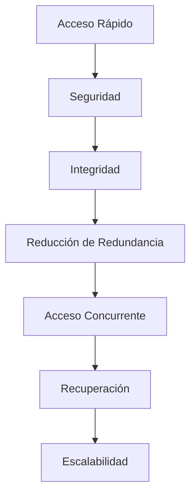

---

## Desventajas de las Bases de Datos

A pesar de sus múltiples ventajas, las bases de datos también presentan algunos desafíos y limitaciones:

### 1. Costo de Implementación y Mantenimiento
Requieren inversión en hardware, software, licencias y personal especializado. El mantenimiento y actualización pueden ser costosos.

### 2. Complejidad Técnica
El diseño, administración y optimización de una base de datos requieren conocimientos avanzados y experiencia.

### 3. Dependencia de Personal Especializado
La gestión eficiente depende de administradores y desarrolladores capacitados, lo que puede limitar la autonomía de la organización.

### 4. Problemas de Rendimiento
Si no se gestiona adecuadamente, una base de datos puede sufrir lentitud, bloqueos o cuellos de botella, especialmente con grandes volúmenes de datos.

### 5. Riesgo de Seguridad
Aunque ofrecen mecanismos de protección, las bases de datos pueden ser vulnerables a ataques, robos de información o errores humanos.

### 6. Migración y Compatibilidad
Cambiar de SGBD o migrar datos entre sistemas puede ser complejo y arriesgado, requiriendo planificación y pruebas exhaustivas.

### Ejemplo Real
En una empresa pequeña, la implementación de una base de datos puede ser costosa y requerir capacitación, lo que representa un desafío frente a sistemas más simples.

### Gráfico de Desventajas

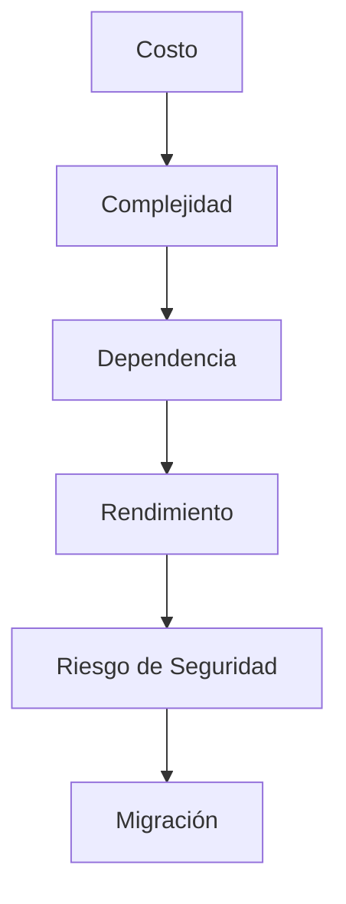

---

## Ejemplo Práctico

A continuación se presenta un caso real y completo de uso de bases de datos en una empresa de logística:

### Contexto
La empresa "TransLog" gestiona envíos nacionales e internacionales. Necesita controlar clientes, paquetes, rutas, vehículos y empleados.

### Estructura de la Base de Datos
- **Clientes:** ID, nombre, dirección, teléfono, historial de envíos.
- **Paquetes:** ID, descripción, peso, dimensiones, estado, cliente asociado.
- **Rutas:** ID, origen, destino, distancia, tiempo estimado.
- **Vehículos:** ID, tipo, capacidad, estado, ruta asignada.
- **Empleados:** ID, nombre, puesto, vehículo asignado.
- **Envíos:** ID, paquete, ruta, vehículo, fecha, estado.

### Consultas Comunes
- ¿Cuántos paquetes envió un cliente en el último mes?
- ¿Qué vehículos están disponibles para una ruta específica?
- ¿Cuál es el estado de un envío internacional?
- ¿Qué empleados están asignados a una ruta determinada?

### Ejemplo de Consulta SQL
```sql
SELECT c.nombre, COUNT(e.id) AS envios_mes
FROM clientes c
JOIN envios e ON c.id = e.cliente
WHERE e.fecha BETWEEN '2025-09-01' AND '2025-09-30'
GROUP BY c.nombre;
```

### Gráfico de Relaciones

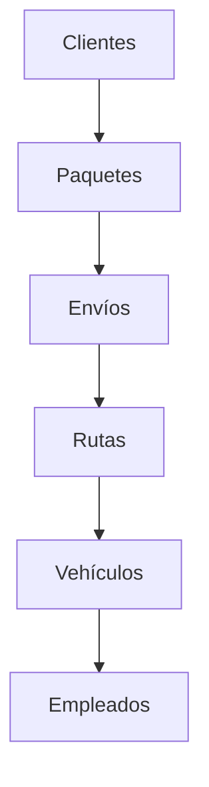

### Beneficios Observados
- Reducción de errores y duplicidad de datos.
- Acceso rápido a información clave para la toma de decisiones.
- Seguridad y trazabilidad de los envíos.
- Optimización de rutas y recursos.

---

## Gráfico: Arquitectura de un Sistema de Base de Datos

La arquitectura de un sistema de base de datos puede variar según el tamaño y las necesidades de la organización, pero generalmente incluye los siguientes componentes:

### 1. Servidor de Base de Datos
Es el núcleo del sistema, donde se almacenan y gestionan los datos. Puede estar en un servidor físico, virtual o en la nube.

### 2. Clientes o Aplicaciones
Son los programas o interfaces que utilizan los usuarios para interactuar con la base de datos. Pueden ser aplicaciones web, móviles, de escritorio o sistemas integrados.

### 3. Red de Comunicación
Permite la conexión entre los clientes y el servidor, asegurando la transmisión segura y eficiente de los datos.

### 4. Módulos de Seguridad
Incluyen firewalls, sistemas de autenticación, encriptación y auditoría para proteger la información.

### 5. Sistemas de Respaldo y Recuperación
Garantizan la disponibilidad y restauración de los datos ante fallos o desastres.

### Ejemplo de Arquitectura
En una empresa multinacional, los empleados acceden a la base de datos desde diferentes países a través de aplicaciones web, conectándose a servidores distribuidos y protegidos por sistemas de seguridad avanzados.

### Gráfico Arquitectónico

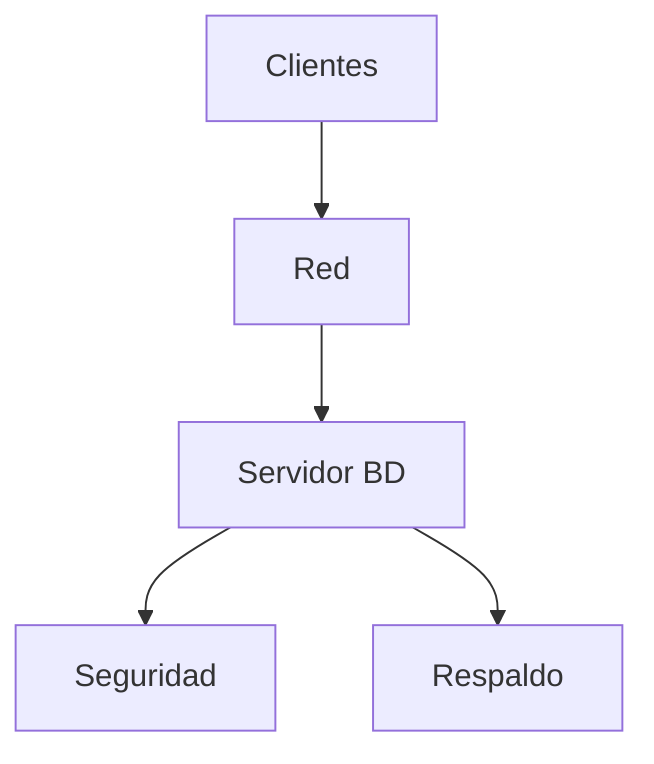

---

## Conclusión

Las bases de datos son el pilar fundamental de la gestión moderna de la información. Su evolución ha permitido a las organizaciones almacenar, proteger, analizar y compartir datos de manera eficiente y segura, facilitando la toma de decisiones y la optimización de procesos.

Un buen diseño y administración de bases de datos garantiza integridad, seguridad, escalabilidad y rendimiento, adaptándose a los desafíos tecnológicos y normativos actuales. El rol del DBA, el uso de lenguajes especializados y la elección del modelo adecuado son claves para el éxito de cualquier sistema de información.

En el futuro, las bases de datos seguirán evolucionando, integrando inteligencia artificial, big data y tecnologías emergentes para responder a las necesidades de un mundo cada vez más digital y conectado.

---

**Tip:** Siempre realiza copias de seguridad periódicas, controla los accesos y mantente actualizado en buenas prácticas de seguridad y administración de bases de datos.
