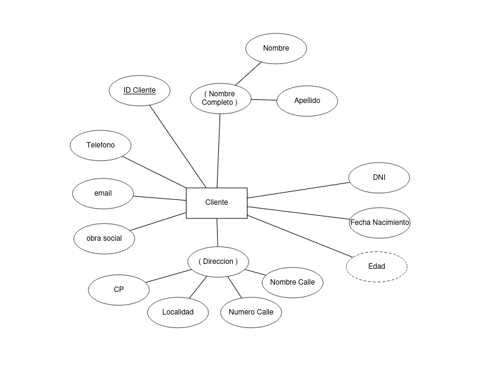
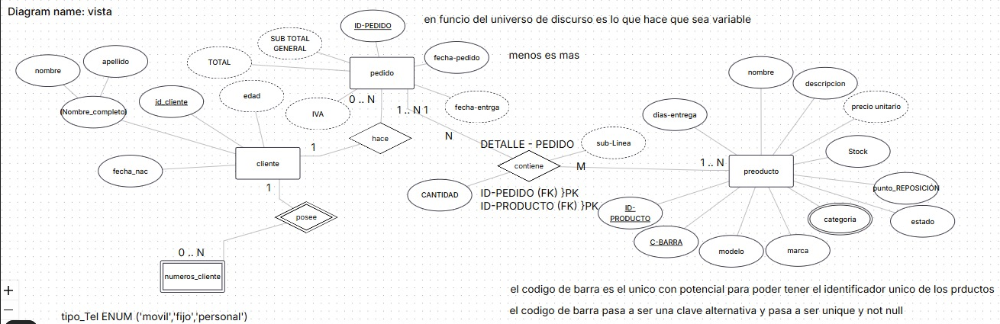
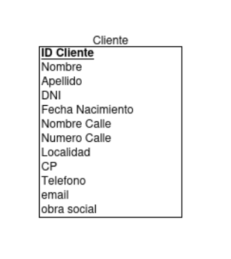

# Capítulo 1: Bases de Datos y Usuarios de Bases de Datos
Capítulo 1: Bases de Datos y Usuarios de Bases de Datos
## 1.1 Introducción
Una base de datos es una colección organizada de datos que se almacenan y gestionan electrónicamente. Las bases de datos permiten a los usuarios almacenar, recuperar y manipular datos de manera eficiente. Los sistemas de gestión de bases de datos (SGBD) son software que facilitan estas operaciones.

- Las bases de datos están presentes en casi todas las actividades cotidianas: banca, reservas, bibliotecas, supermercados, etc.
- Tradicionalmente almacenaban datos textuales o numéricos, pero hoy gestionan también imágenes, videos y grandes volúmenes de datos (big data, NOSQL).
- Empresas como Google y Amazon usan sistemas avanzados de bases de datos para búsquedas y almacenamiento en la nube.
Aplicaciones modernas incluyen:
- Bases de datos multimedia (imágenes, audio, video)
- Sistemas de información geográfica (SIG)
- Data warehouses y OLAP para análisis empresarial
- Bases de datos en tiempo real para procesos industriales
- Recuperación de información en la web

- Definición básica: una base de datos es una colección de datos relacionados, con significado y que pueden ser registrados.
    - Propiedades clave:
        - Representa un aspecto del mundo real (mini-mundo o universo del discurso)
        - Es una colección coherente y con significado, no solo datos aleatorios
        - Está diseñada, construida y poblada con datos para un propósito específico, con un grupo de
usuarios y aplicaciones predefinidas en mente

- Una base de datos tiene:
    - Una fuente de datos (origen)
    - Interacción con eventos del mundo real
    - Una audiencia interesada en su contenido
    - Debe reflejar los cambios del mini-mundo de forma precisa y rápida para ser confiable.
    - El tamaño y complejidad de una base de datos puede variar: desde listas pequeñas hasta sistemas gigantes como Amazon, con millones de usuarios y productos, y terabytes de datos.
    - Las bases de datos pueden ser manuales o computarizadas.
    - Las bases de datos computarizadas son gestionadas por sistemas de gestión de bases de datos (SGBD), que permiten a los usuarios crear, mantener y manipular las bases de datos.

## 1.1 Sobre DBMS (Sistema de Gestión de Bases de Datos)

- Un DBMS es un software que permite crear y mantener una base de datos.
- Funciones principales:
  - Definir la base de datos: tipos de datos, estructuras y restricciones (meta-datos en el catálogo).
  - Construir la base de datos: almacenar los datos en medios controlados.
  - Manipular la base de datos: consultar, actualizar y generar informes.
  - Compartir la base de datos: acceso simultáneo de múltiples usuarios y programas.
- Los programas de aplicación interactúan con el DBMS mediante consultas (queries) y transacciones (lectura/escritura de datos).
- El DBMS protege la base de datos contra fallos y accesos no autorizados, y permite su evolución ante nuevos requisitos.
- Aunque se pueden crear programas personalizados, el DBMS centraliza y simplifica la gestión.
- El sistema de base de datos está formado por la base de datos y el software DBMS.

## 1.2 Fases del diseño de una base de datos

- Especificación y análisis de requisitos: se documentan las necesidades del usuario.
- Diseño conceptual: se transforman los requisitos en un modelo de alto nivel, generalmente usando el modelo Entidad-Relación (ER).
- Diseño lógico: se traduce el diseño conceptual a un modelo de datos que pueda implementarse en un DBMS comercial (por ejemplo, relacional).
- Diseño físico: se especifica cómo se almacenarán y accederán los datos.

## 1.3 Características del Enfoque de Bases de Datos

- El enfoque de bases de datos se diferencia del procesamiento tradicional de archivos, donde cada usuario gestionaba sus propios archivos, generando:
  - Redundancia de datos (información duplicada)
  - Desperdicio de espacio
  - Inconsistencia de datos (actualizaciones no uniformes)
- El enfoque de base de datos utiliza un único repositorio de datos, accesible por múltiples usuarios.
- Características principales:
  - Naturaleza autodescriptiva del sistema de base de datos
  - Aislamiento entre programas y datos, y abstracción de datos
  - Soporte de múltiples vistas de los datos
  - Compartición de datos y procesamiento de transacciones multiusuario
- La base de datos se mantiene actualizada para reflejar el estado del mini-mundo.

### 1.3.1 Naturaleza Autodescriptiva de un Sistema de Base de Datos

- Un sistema de base de datos almacena no solo los datos, sino también una definición completa de su estructura y restricciones.
- Esta definición se guarda en el catálogo del DBMS (meta-datos).
- El catálogo incluye información sobre:
  - Estructura de archivos
  - Tipo y formato de almacenamiento de cada elemento de datos
  - Restricciones de los datos
- El DBMS utiliza los meta-datos para entender y gestionar cualquier base de datos, permitiendo trabajar con distintas aplicaciones siempre que la definición esté en el catálogo.
- En el procesamiento tradicional de archivos, la definición de los datos estaba integrada en los programas, lo que los hacía dependientes de una estructura específica.
- Ejemplo: El catálogo del DBMS de una universidad almacena las definiciones de archivos como STUDENT, permitiendo al DBMS saber la estructura y detalles de cada campo (nombre, tipo de dato, etc.) al acceder a los datos.

### 1.3.2 Aislamiento entre Programas y Datos, y Abstracción de Datos

- En el procesamiento tradicional de archivos, cualquier cambio en la estructura de los datos requería modificar todos los programas que los usaban.
- En un entorno DBMS, esto rara vez es necesario gracias a la independencia programa-datos: los cambios en la estructura se realizan en el catálogo y no afectan a los programas existentes.
- En bases de datos orientadas a objetos y objeto-relacionales, también existe independencia programa-operación: se pueden cambiar las implementaciones de las operaciones sin afectar los programas que las usan.
- La abstracción de datos permite ambas independencias, presentando una visión conceptual de los datos y ocultando los detalles de almacenamiento e implementación.
- El DBMS utiliza modelos de datos lógicos (objetos, propiedades, relaciones) que son más fáciles de entender que los detalles técnicos de almacenamiento.

### 1.3.3 Soporte de Múltiples Vistas de los Datos

- Una base de datos puede tener distintos tipos de usuarios, cada uno con necesidades diferentes de información.
- El DBMS permite definir vistas, que son perspectivas personalizadas de los datos.
- Una vista puede ser:
  - Un subconjunto de la base de datos
  - Datos virtuales derivados de los archivos de la base de datos, pero no almacenados explícitamente
- Las vistas facilitan el acceso selectivo y seguro a la información, adaptándose a los requerimientos de cada usuario o aplicación.

### 1.3.4 Compartición de Datos y Procesamiento de Transacciones Multiusuario

- Un DBMS multiusuario permite que varios usuarios accedan y actualicen la base de datos simultáneamente.
- Incluye software de control de concurrencia para asegurar que las actualizaciones concurrentes sean correctas y controladas (por ejemplo, evitar que dos agentes asignen el mismo asiento).
- Este tipo de aplicaciones se denominan OLTP (procesamiento de transacciones en línea).
- Permite definir múltiples vistas para diferentes usuarios según sus necesidades.
- El concepto de transacción es central: una transacción es un conjunto de operaciones de acceso (lectura/actualización) que debe ejecutarse correctamente y sin interferencias.
- El DBMS garantiza dos propiedades clave:
  - Aislamiento: cada transacción parece ejecutarse de forma independiente.
  - Atomicidad: todas las operaciones de la transacción se completan, o ninguna lo hace.
- Estas características diferencian a un DBMS del procesamiento tradicional de archivos.

## 1.4 Actores en Escena

- En una organización, varias personas participan en el diseño, uso y mantenimiento de la base de datos. Se denominan actores en escena.

### 1.4.1 Administradores de Bases de Datos (DBA)
- Supervisan los recursos compartidos de la base de datos.
- Responsabilidades:
  - Autorizar el acceso
  - Coordinar y monitorear el uso
  - Adquirir recursos de software y hardware
  - Resolver problemas de seguridad y rendimiento
- En grandes organizaciones, el DBA puede contar con un equipo de apoyo.

### 1.4.2 Diseñadores de Bases de Datos
- Identifican qué datos se almacenarán y cómo se estructurarán.
- Se comunican con los usuarios para entender requisitos y crear un diseño adecuado.
- Desarrollan vistas para cada grupo de usuarios y las integran en el diseño final.

### 1.4.3 Usuarios Finales
- Personas que acceden a la base de datos para consultar, actualizar y generar informes.
- Tipos de usuarios finales:
  - Casual: Acceden ocasionalmente, buscan información variada (gerentes, exploradores).
  - Ingenuos/Paramétricos: Realizan consultas y actualizaciones estándar (cajeros, agentes de reservas, empleados de envío, usuarios de redes sociales).
  - Sofisticados: Ingenieros, científicos, analistas que implementan sus propias aplicaciones.
  - Autónomos: Mantienen bases de datos personales con software listo para usar.
- El DBMS ofrece facilidades de acceso adaptadas a cada tipo de usuario.

### 1.4.4 Analistas de Sistemas y Programadores de Aplicaciones (Ingenieros de Software)
- Los analistas de sistemas definen los requisitos de los usuarios finales y desarrollan especificaciones para transacciones enlatadas.
- Los programadores de aplicaciones implementan, prueban, depuran, documentan y mantienen estas especificaciones.
- Estos profesionales deben conocer a fondo las capacidades del DBMS.

## 1.5 Trabajadores Tras Bambalinas
- Además de los usuarios y diseñadores, hay profesionales que trabajan en el diseño, desarrollo y operación del software DBMS y su entorno.
- Incluyen:
  - Diseñadores e implementadores de sistemas DBMS: Desarrollan los módulos e interfaces del DBMS, interactuando con otros sistemas como el SO y compiladores.
  - Desarrolladores de herramientas: Crean software para modelado, diseño, monitoreo, prototipado y simulación de bases de datos.
  - Personal de operación y mantenimiento: Gestionan el entorno de hardware y software del sistema de base de datos.
- Aunque son esenciales para el funcionamiento del sistema, generalmente no usan el contenido de la base de datos para sus propios fines.

## 1.6 Ventajas de Usar el Enfoque DBMS

### 1.6.1 Control de la Redundancia
- En el software tradicional, cada grupo de usuarios mantenía sus propios archivos, generando:
  - Duplicación de esfuerzo
  - Desperdicio de espacio
  - Inconsistencia de datos
- El enfoque DBMS integra las vistas de los usuarios y almacena cada elemento lógico de datos en un solo lugar (normalización), asegurando consistencia y ahorro de espacio.
- A veces se permite redundancia controlada (desnormalización) para mejorar el rendimiento de consultas, pero el DBMS debe controlar esta redundancia para evitar inconsistencias mediante verificaciones automáticas.

### 1.6.2 Restricción del Acceso No Autorizado
- No todos los usuarios pueden acceder a toda la información en una base de datos compartida.
- El DBMS debe ofrecer un subsistema de seguridad y autorización para controlar el acceso y las operaciones permitidas.
- El DBA crea cuentas y especifica restricciones, que el DBMS aplica automáticamente.
- Se controla quién puede usar ciertas funcionalidades y qué transacciones pueden ejecutar los usuarios.

### 1.6.3 Provisión de Almacenamiento Persistente para Objetos de Programa
- Las bases de datos pueden almacenar de forma persistente objetos y estructuras de datos de programas.
- En los lenguajes de programación, los valores de variables y objetos se pierden al finalizar el programa, salvo que se guarden explícitamente en archivos (lo que suele requerir conversiones de formato).
- Los sistemas de bases de datos orientadas a objetos son compatibles con lenguajes como C++ y Java, permitiendo almacenar y recuperar objetos complejos de manera directa y automática.
- Estos objetos almacenados se denominan persistentes.
- Los sistemas tradicionales sufrían el problema de desajuste de impedancia (incompatibilidad entre estructuras de datos del DBMS y del lenguaje de programación).
- Los DBMS orientados a objetos buscan resolver este problema ofreciendo compatibilidad directa.

### 1.6.4 Provisión de Estructuras de Almacenamiento y Técnicas de Búsqueda para un Procesamiento Eficiente de Consultas
- Los sistemas de bases de datos deben ejecutar consultas y actualizaciones de manera eficiente.
- El DBMS utiliza estructuras de datos y técnicas de búsqueda especializadas (como índices basados en árboles o hash) para acelerar la recuperación de registros.
- Los datos se almacenan en disco, por lo que el DBMS emplea módulos de almacenamiento en búfer o caché para gestionar lecturas y escrituras, mejorando el rendimiento.
- El módulo de procesamiento y optimización de consultas selecciona el plan de ejecución más eficiente según las estructuras de almacenamiento disponibles.
- La decisión sobre qué índices crear y mantener forma parte del diseño físico y la sintonización de la base de datos, responsabilidad del equipo del DBA.

### 1.6.5 Provisión de Copias de Seguridad y Recuperación
- Un DBMS debe contar con mecanismos para recuperarse de fallos de hardware o software.
- El subsistema de copias de seguridad y recuperación restaura la base de datos al estado previo a una transacción en caso de fallo.
- Las copias de seguridad en disco son esenciales ante fallos catastróficos.

### 1.6.6 Provisión de Múltiples Interfaces de Usuario
- Un DBMS debe ofrecer diversas interfaces para distintos tipos de usuarios y niveles técnicos:
  - Aplicaciones móviles: acceso desde dispositivos móviles.
  - Interfaces basadas en menús: guían al usuario mediante opciones.
  - Interfaces basadas en formularios: permiten insertar o recuperar datos fácilmente.
  - Interfaces gráficas de usuario (GUI): muestran esquemas y permiten consultas visuales.
  - Interfaces de lenguaje natural: aceptan solicitudes en lenguaje humano y las interpretan.
  - Búsqueda basada en palabras clave: similar a motores de búsqueda web.
  - Entrada y salida de voz: consultas y respuestas por voz en aplicaciones específicas.
  - Interfaces para usuarios paramétricos: comandos abreviados para operaciones repetitivas.
  - Interfaces para el DBA: comandos privilegiados para administración y gestión.

### 1.6.7 Representación de Relaciones Complejas entre Datos
- Una base de datos puede contener datos muy interrelacionados (por ejemplo, un estudiante relacionado con varios reportes de calificaciones).
- El DBMS debe:
  - Representar diversas relaciones complejas entre los datos.
  - Permitir definir nuevas relaciones según sea necesario.
  - Facilitar la recuperación y actualización eficiente de datos relacionados.

### 1.6.8 Aplicación de Restricciones de Integridad
- Las bases de datos deben cumplir restricciones de integridad para asegurar la validez de los datos.
- El DBMS permite definir y aplicar restricciones como:
  - Tipos de datos: especificar el tipo permitido (entero, cadena, etc.).
  - Restricciones de unicidad (clave): asegurar que ciertos valores sean únicos (ej. número de curso).
  - Restricciones de integridad referencial: asegurar que los registros estén correctamente relacionados (ej. una sección debe estar asociada a un curso válido).
- Estas restricciones reflejan la semántica de los datos y el mini-mundo representado.
- Los diseñadores de bases de datos identifican y especifican estas restricciones, que el DBMS puede aplicar automáticamente.
- Algunas restricciones se denominan reglas de negocio.
- El DBMS no puede detectar todos los errores semánticos, pero sí valida los valores según las reglas definidas y el modelo de datos.

### 1.6.9 Permitiendo la Inferencia y Acciones Usando Reglas y Disparadores
- Algunos sistemas de bases de datos permiten definir reglas de deducción para inferir nueva información a partir de los datos almacenados (bases de datos deductivas).
- Estas reglas permiten especificar condiciones complejas de forma declarativa, sin necesidad de escribir código procedimental.
- En bases de datos relacionales, se pueden asociar disparadores (triggers) a las tablas:
  - Un disparador es una regla que se activa ante actualizaciones en la tabla y puede ejecutar operaciones adicionales (actualizar otras tablas, enviar mensajes, etc.).
- Los procedimientos almacenados son rutinas más complejas que se ejecutan cuando se cumplen ciertas condiciones.
- Los sistemas de bases de datos activos permiten definir reglas que inician acciones automáticamente ante eventos y condiciones específicas.

### 1.6.10 Implicaciones Adicionales del Uso del Enfoque de Bases de Datos
- Potencial para aplicar estándares: El DBA puede definir y aplicar estándares organizacionales (nombres, formatos, terminología), facilitando la comunicación y cooperación entre departamentos.
- Reducción del tiempo de desarrollo de aplicaciones: Una vez operativa la base de datos, el desarrollo de nuevas aplicaciones es mucho más rápido (hasta 4-6 veces menos tiempo que con sistemas de archivos).
- Flexibilidad: Los DBMS modernos permiten modificar la estructura de la base de datos sin afectar los datos ni los programas existentes, adaptándose fácilmente a nuevos requisitos.
- Disponibilidad de información actualizada: Las actualizaciones son inmediatas y accesibles para todos los usuarios, lo que es esencial en aplicaciones como sistemas de reservas.
- Economías de escala: Permite consolidar datos y aplicaciones, reducir redundancias y aprovechar mejor los recursos tecnológicos, disminuyendo los costos operativos y de gestión.

## 1.7 Breve Historia de las Aplicaciones de Bases de Datos
- **Primeras aplicaciones (sistemas jerárquicos y de red):** Gestionaban grandes volúmenes de registros, mezclando relaciones conceptuales con almacenamiento físico, lo que dificultaba la abstracción y la independencia programa-datos. Predominaron entre los años 60 y 80.
- **Bases de datos relacionales:** Separan el almacenamiento físico de la representación conceptual, introducen lenguajes de consulta de alto nivel y mejoran el rendimiento con nuevas técnicas. Se convirtieron en el tipo dominante de sistema de base de datos.
- **Bases de datos orientadas a objetos (OODBs):** Surgen para almacenar objetos complejos y estructurados, incorporando conceptos como encapsulación y herencia. Su adopción fue limitada, pero muchos conceptos se integraron a los DBMS relacionales (ORDBMS).
- **Intercambio de datos en la web usando XML:** El comercio electrónico y la web impulsaron el uso de DBMS para extraer información dinámica. XML se convirtió en estándar para el intercambio de datos.
- **Extensión de capacidades para nuevas aplicaciones:** Los DBMS se adaptaron para aplicaciones científicas, imágenes, videos, minería de datos, aplicaciones espaciales y series temporales, añadiendo nuevas estructuras y módulos especializados.
- **Big Data y bases de datos NOSQL:** El crecimiento de datos impulsó nuevos sistemas para datos no tradicionales. NOSQL permite combinar sistemas SQL y NOSQL según las necesidades.

## 1.8 Cuándo No Usar un DBMS
- Puede no ser conveniente usar un DBMS cuando:
  - Se requiere una inversión inicial alta en hardware, software y capacitación.
  - La aplicación es simple, bien definida y no se espera que cambie.
  - Hay requisitos estrictos de tiempo real que el DBMS no puede cumplir.
  - El sistema es embebido y tiene capacidad de almacenamiento limitada.
  - No se necesita acceso multiusuario.
- En estos casos, puede ser preferible desarrollar software personalizado optimizado para necesidades específicas.

## 1.9 Resumen
- Una base de datos es una colección de datos relacionados que representan un aspecto del mundo real.
- Un DBMS es un software generalizado para implementar y mantener bases de datos computarizadas.
- Se revisaron las características clave del enfoque de bases de datos, los actores involucrados y las capacidades esenciales de un DBMS.
- Se presentaron ventajas adicionales, una perspectiva histórica y situaciones donde no conviene usar un DBMS.

## Resumen para el parcial

- Saber definir el problema y el alcance de una base de datos, identificando claramente qué se debe resolver y qué queda fuera de alcance.
- Identificar entidades, atributos y atributos multivaluados (por ejemplo, teléfono como atributo multivaluado de cliente).
- Justificar decisiones de diseño, como la necesidad de una tabla propia para teléfonos.
- Aplicar reglas de negocio básicas para asegurar la integridad de los datos (identificador único, formato validado, contacto obligatorio).
- Reconocer errores frecuentes: duplicar clientes para agregar teléfonos, guardar varios teléfonos en una sola columna, suponer ventas en el primer ciclo.
- Documentar correctamente los acuerdos y convenciones para evitar retrabajos y errores.
- Comprender el ciclo de diseño: análisis de requerimientos → modelo conceptual (E-R) → modelo lógico (relacional) → modelo físico (SQL).
- Entender la trazabilidad entre los modelos y cómo cada decisión impacta en las siguientes fases.
- Aplicar convenciones de nombres y buenas prácticas en el diseño.
- Saber diferenciar entre problema, requerimiento, regla de negocio, entidad, atributo y atributo multivaluado.
- Conocer los actores involucrados en el diseño y uso de la base de datos (DBA, diseñadores, usuarios finales, ingenieros de software).
- Reconocer las ventajas del enfoque DBMS frente al procesamiento tradicional de archivos: control de redundancia, seguridad, flexibilidad, interfaces, integridad, recuperación, etc.
- Saber cuándo no conviene usar un DBMS y optar por soluciones personalizadas.

## Resumen DIKW y flujo de información para el parcial

- Comprender el modelo DIKW: cómo los datos se transforman en información, conocimiento y decisiones.
  - Dato: hecho puntual, sin contexto.
  - Información: dato con significado y propósito.
  - Conocimiento: patrón o relación que permite inferir.
  - Decisión: acción basada en evidencia.
- Saber priorizar preguntas de negocio y definir los datos mínimos necesarios para responderlas.
- Justificar la recolección de datos: evitar recolectar datos “por si acaso” y enfocarse en lo que agrega valor.
- Diferenciar entre dato, información, conocimiento, decisión y metadato.
- Aplicar la regla de negocio: cada cliente debe tener al menos un medio de contacto válido.
- Reconocer errores frecuentes: mezclar datos y metadatos, saltar a SQL sin definir preguntas de negocio.
- Entender la trazabilidad entre modelos conceptual, lógico y físico, y cómo las decisiones de negocio impactan en el diseño de la base de datos.
- Saber que el diseño debe estar alineado con las decisiones reales y las necesidades del negocio.

## Resumen SI, BD y SGBD (foco relacional) para el parcial

- Distinguir claramente entre Sistema de Información (SI), Base de Datos (BD) y Sistema Gestor de Bases de Datos (SGBD/DBMS):
  - SI: conjunto de personas, procesos y tecnología que transforma datos en decisiones.
  - BD: colección organizada y coherente de datos, persistida para consulta y actualización controlada.
  - SGBD/DBMS: software que define, crea, mantiene y asegura el acceso a la BD según un modelo (relacional, documentos, grafos, etc.).
- En la materia, "BD" se entiende como base de datos relacional y "SGBD" como RDBMS (ejemplo: MySQL).
- El modelo relacional estructura la información en tablas (relaciones), filas (tuplas) y columnas (atributos), y se consulta con SQL.
- Integridad y restricciones (PK, FK, UNIQUE, CHECK) se aplican en el motor relacional.
- La normalización es clave para reducir redundancia y anomalías.
- Las transacciones en RDBMS suelen ser ACID (Atomicidad, Consistencia, Aislamiento, Durabilidad).
- Mantener fuera de discusión otros modelos no relacionales en la U1.
- Saber que el diseño conceptual, lógico y físico se basa en el enfoque relacional y que las decisiones de negocio impactan en la estructura y restricciones del modelo.

Este resumen te ayuda a enfocar el estudio en los conceptos clave de SI, BD y SGBD, y el enfoque relacional que se evalúa en el parcial.

## Resumen de requerimientos y reglas mínimas para el parcial

- Saber convertir la narrativa del cliente en requerimientos verificables y reglas de negocio mínimas.
- Usar plantillas claras para definir requerimientos: rótulo, descripción, criterio de aceptación e impacto de datos.
- Identificar y justificar los requerimientos iniciales:
  - Registrar clientes con datos básicos y al menos un contacto válido.
  - Almacenar 0..n teléfonos por cliente, cada uno con tipo y número.
  - Permitir búsqueda de clientes por nombre, documento, teléfono o correo.
  - Evitar duplicados evidentes al momento del alta.
- Declarar y aplicar reglas de negocio mínimas:
  - Identificador único para cada cliente.
  - Contactabilidad mínima (≥ 1 medio de contacto válido).
  - Teléfonos multivaluados, sin repetidos para el mismo cliente.
  - Tipo de teléfono estandarizado (móvil/fijo).
- Definir atributos candidatos de la entidad Cliente y distinguir entre atributos simples y multivaluados.
- Aplicar convenciones de nombres claras y legibles.
- Diferenciar entre requerimiento y regla de negocio, atributo y metadato, atributo simple y multivaluado.
- Evitar errores frecuentes: convertir todo en obligatorio, tratar teléfono como texto libre, agregar ventas/productos fuera de alcance.
- Entender la trazabilidad entre modelos conceptual, lógico y físico, y cómo los requerimientos y reglas impactan en el diseño y la implementación.

## Resumen del ciclo de diseño de BD para el parcial

- Comprender las fases del ciclo de diseño de bases de datos: Análisis, Conceptual, Lógico y Físico.
- Saber qué entregables y criterios de salida debe tener cada fase:
  - Análisis: alcance, requerimientos (R#), reglas (RN#), atributos candidatos; decisión sobre multivaluados.
  - Conceptual: DER de Cliente con atributos simples y multivaluados; nombres legibles y tipificados.
  - Lógico: esquema relacional con tablas, claves y dominios coherentes; sin anticipar SQL.
  - Físico: scripts de `CREATE`, `INSERT` y `SELECT` para validar reglas; solo lo necesario para verificar requerimientos y reglas.
- No avanzar a la siguiente fase sin cumplir los criterios de salida de la fase actual.
- Evitar errores frecuentes: mezclar niveles (ej. decidir FK o tipos SQL en el DER), pasar a SQL sin derivar correctamente atributos multivaluados, agregar entidades fuera de alcance.
- Mantener el foco en la entidad Cliente y el atributo teléfono multivaluado durante toda la U1.
- Entender la trazabilidad entre modelos y cómo cada fase impacta en la siguiente.

## Resumen Entidad vs Atributo para el parcial

- Distinguir claramente entre entidad y atributo:
  - Entidad: objeto del negocio con identidad propia y múltiples registros.
  - Atributo: propiedad que describe a una entidad, sin vida independiente.
- Aplicar pruebas rápidas para decidir:
  - ¿Tiene identidad propia y recibe eventos? → Entidad.
  - ¿Depende totalmente de otra entidad? → Atributo.
  - ¿Puede tener múltiples valores por entidad? → Atributo multivaluado.
- En U1, Cliente es la única entidad; teléfono es atributo multivaluado (0..n por cliente).
- Evitar errores frecuentes:
  - Promover actores (ej. cajero) a entidad cuando están fuera de alcance.
  - Guardar teléfonos separados por comas en una sola columna (viola 1FN).
  - Crear entidad "Teléfono" solo para tener dos tablas en el lógico.
- Justificar decisiones de diseño: teléfono se modela como atributo multivaluado, no como entidad.
- Entender la trazabilidad:
  - Conceptual: DER con Cliente y teléfono multivaluado.
  - Lógico: tabla aparte para teléfonos.
  - Físico: scripts para validar la decisión.
- Mantener el foco en el alcance definido y evitar inflar el modelo con entidades innecesarias.

# Ciclo de Diseño de Bases de Datos

```mermaid

    A[Análisis de Requerimientos] --> B[Diseño Conceptual]
    B --> C[Diseño Lógico]
    C --> D[Diseño Físico]
    D --> E[Implementación y Pruebas]
```

- **Análisis de Requerimientos:** Definir el alcance, identificar requerimientos y reglas de negocio, y decidir sobre atributos multivaluados.
- **Diseño Conceptual:** Crear el Diagrama Entidad-Relación (DER) con entidades y atributos.
  - Tipos de atributos: 
    - **Simples** -> Son indivisibles y almacenan un solo valor.
    - **Multivaluados** -> Pueden almacenar múltiples valores por entidad.
    - **Derivados** -> Se calculan a partir de otros atributos.
    - **Compuestos** -> Se componen de múltiples subatributos.
    - **Clave Candidata** -> Atributo o conjunto de atributos que puede identificar de manera única una entidad.
    
    
- **Diseño Lógico:** Traducir el DER a un esquema relacional con tablas y claves.
    - Definir tablas, claves primarias (PK), claves foráneas (FK) y dominios de atributos (Son los tipos de datos permitidos para cada atributo, por ejemplo, VARCHAR, INT, DATE, etc).
    - Establecer relaciones entre tablas mediante FK.
    - 
  
- **Diseño Físico:** Especificar cómo se almacenarán los datos y generar scripts SQL.
    - Crear scripts de `CREATE TABLE` con definiciones de columnas, tipos de datos y restricciones (PK, FK, UNIQUE, CHECK).
    - Generar scripts de `INSERT` para poblar la base de datos con datos de prueba.
    - Desarrollar scripts de `SELECT` para validar que los requerimientos y reglas de negocio se cumplen.
- **Implementación y Pruebas:** Crear la base de datos y validar que cumple con los requerimientos y reglas definidas.

# Claves
- **Clave Primaria (Primary Key - PK):** Atributo o conjunto de atributos que identifica de manera única cada registro en una tabla. No puede contener valores nulos y debe ser único.
- **Clave Foránea (Foreign Key - FK):** Atributo o conjunto de atributos en una tabla que hace referencia a la clave primaria de otra tabla, estableciendo una relación entre ambas.
- **Clave Candidata:** Atributo o conjunto de atributos que puede identificar de manera única una entidad. Una tabla puede tener múltiples claves candidatas, pero solo una se elige como clave primaria. Las que no sean PK se llaman claves alternas y serán indexadas para optimizar búsquedas.
- **Índice:** Estructura de datos que mejora la velocidad de las operaciones de consulta en una tabla a costa de espacio adicional y tiempo de mantenimiento durante las operaciones de inserción, actualización y eliminación.
- **Dominio:** Conjunto de valores permitidos para un atributo, definido por su tipo de dato (por ejemplo, VARCHAR, INT, DATE, etc.) y posibles restricciones (como longitud máxima, formato, etc.).
- **Normalización:** Proceso de organizar los datos en una base de datos para reducir la redundancia y mejorar la integridad de los datos. Involucra dividir tablas grandes en tablas más pequeñas y definir relaciones entre ellas.

# Relaciones
- **Relación Uno a Uno (1:1):** Cada registro en la tabla A está asociado con un solo registro en la tabla B, y viceversa. 
- **Relación Uno a Muchos (1:N):** Un registro en la tabla A puede estar asociado con múltiples registros en la tabla B, pero un registro en la tabla B está asociado con un solo registro en la tabla A. La fk se coloca en la tabla del lado "muchos".
- **Relación Muchos a Muchos (M:N):** Múltiples registros en la tabla A pueden estar asociados con múltiples registros en la tabla B. Esta relación se implementa mediante una tabla intermedia que contiene claves foráneas de ambas tablas. La tabla intermedia puede tener su propia clave primaria compuesta por las fk o una pk adicional.